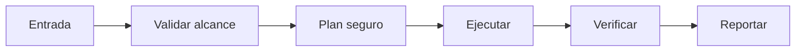

# 🧬 Genome Weaver

<p align="center">
  
</p>

<p align="center">
  <a href="./README.md"></a>
  <a href="./README.es.md"></a>
</p>

## Resumen
Evolución darwiniana de skills: genera variantes paralelas, las prueba en shadow mode (low-compute), selecciona la mejor basada en métricas reales (éxito, tiempo, costo tokens).

## Instalación
```bash
git clone https://github.com/smouj/Genome-Weaver.git
cd Genome-Weaver
cat SKILL.es.md
```

## Arquitectura de entendimiento


## Estado
Iniciando

## Dificultad
Alta
