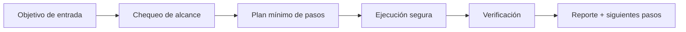

# 🧬 Genome Weaver

<p align="center">
  
</p>

<p align="center">
  <a href="./README.md"></a>
  <a href="./README.es.md"></a>
</p>

<p align="center"><em>🧬 Evolución darwiniana de skills.</em></p>

---

## Resumen
Motor evolutivo que genera variantes de skills, ejecuta pruebas A/B, mide desempeño y selecciona la configuración más efectiva según éxito, coste y latencia.

## Arquitectura de entendimiento


## Instalación
```bash
git clone https://github.com/smouj/Genome-Weaver.git
cd Genome-Weaver
cat SKILL.es.md
```

## Uso rápido
```bash
printf "ejecutando genome-weaver...\n"
```

## Estado
- Status: Iniciando
- Dificultad: Alta

## Roadmap
- [ ] Implementar lógica core v0
- [ ] Añadir tests de integración
- [ ] Publicar tag estable v1.0.0
