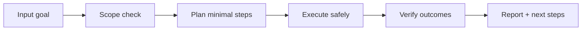

# 🧬 Genome Weaver

<p align="center">
  
</p>

<p align="center">
  <a href="./README.md"></a>
  <a href="./README.es.md"></a>
</p>

<p align="center"><em>🧬 Evolución darwiniana de skills.</em></p>

---

## Overview
Motor evolutivo que genera variantes de skills, ejecuta pruebas A/B, mide desempeño y selecciona la configuración más efectiva según éxito, coste y latencia.

## Architecture of understanding


## Installation
```bash
git clone https://github.com/smouj/Genome-Weaver.git
cd Genome-Weaver
# read the contract
cat SKILL.md
```

## Quick usage
```bash
# Example placeholder command
printf "running genome-weaver...\n"
```

## Badges
- Status: Initiating
- Difficulty: Alta

## Roadmap
- [ ] Implement core logic v0
- [ ] Add integration tests
- [ ] Publish stable tag v1.0.0
